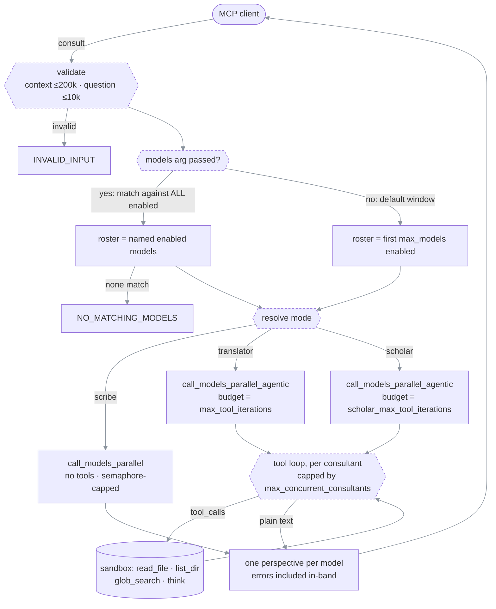

# House of Wisdom MCP

> **What this is** — an MCP (Model Context Protocol) server that asks the same question to several
> different AI model families at once and hands you back every answer, unmerged.
>
> **How to read it** — [What it is](#what-it-is-and-what-it-is-not) → [Quick start](#quick-start) →
> [The three modes](#the-three-modes) → [The two tools](#the-two-tools) →
> [How a call flows](#how-a-call-flows) → [Installation](#installation) →
> [Configuration](#configuration-reference). Go to [Sharp edges](#sharp-edges) when something
> surprises you.
>
> **Requires** — Python 3.10+, `uv`/`uvx`, and at least **two** enabled models.
>
> **Reflects code as of** — 2026-07-22, `master`, package version `0.7.1`.

The medieval [Bayt al-Hikma](https://en.wikipedia.org/wiki/House_of_Wisdom) worked because it was
diverse: scholars, translators, and copyists from many traditions read the same questions through
different lenses, and the reader weighed the results. This server does the same with models —
OpenAI, Anthropic and Google via OpenRouter, DeepSeek, local Ollama, or any OpenAI-compatible
endpoint.

---

## What it is, and what it is not

| It does | It does not |
| --- | --- |
| Fire N models in parallel on one question | Merge, rank, vote, or summarize their answers |
| Return one complete, self-contained analysis per model | Return a single "council answer" |
| Optionally let each model read your codebase first (read-only) | Ever write, execute, or network beyond each model's own endpoint |
| Tag each answer with the mode it was asked to run in | Tell you which answer is correct |

**There is no synthesizer.** The caller — your IDE agent — reads every perspective and decides.
Treating any single perspective as ground truth defeats the design.

**When it earns its cost.** A call spends several model API calls and tens of seconds, so it pays
off when a *different model family* seeing the problem would plausibly change the outcome: a
contested design decision, a bug you have been circling without converging, a high-stakes or
hard-to-reverse conclusion, or an explicit request for a second opinion. Work that just needs one
mind's focused reasoning does not need a council.

---

## Quick start

```bash
# 1. Get a config file
curl -O https://raw.githubusercontent.com/EzzoHamdan/house-of-wisdom-mcp/master/config.example.yaml

# 2. Edit it — the only field you MUST set is `models`, and at least 2 must be enabled.

# 3. Register the server with your MCP client (see Installation for per-client syntax):
#    command: uvx
#    args:    --from git+https://github.com/EzzoHamdan/house-of-wisdom-mcp@master
#             ai-council --config /absolute/path/to/config.yaml

# 4. Restart the client, then ask your agent to call `list_models`.
```

If `list_models` returns your roster, the server is loaded. Then try one `consult`
call in `scribe` mode — it is the fast path and needs no filesystem access.

---

## The three modes

One argument, `mode`, decides how much freedom each consultant gets. It is the only knob that
changes behavior at call time.

| Mode | Tools | Tool budget | Scope discipline | Use when |
| --- | --- | --- | --- | --- |
| `scribe` | none | — | — | You already pasted the relevant code into `context`, or the question is a judgment call needing no lookup |
| `translator` | read-only | `max_tool_iterations` (built-in **8**) | `scope_hint` is a **cage** — the prompt forbids wandering | You know which files matter and want each model to verify against them |
| `scholar` | read-only | `scholar_max_tool_iterations` (built-in **64**) | `scope_hint` is a **starting point** — the prompt permits following leads | You do *not* know which files matter |

With default budgets, wall-clock ordering runs `scribe` < `translator` < `scholar`; absolute
numbers depend entirely on which models you configured and whether they are local or remote.
Nothing enforces that ordering, though — raising `max_tool_iterations` above
`scholar_max_tool_iterations` inverts it.

### How the effective mode is resolved

Precedence, highest first (`synthesis.py::collect_perspectives`):

| # | Source | Result |
| --- | --- | --- |
| 1 | `mode` argument, if it is one of `scribe` / `translator` / `scholar` (case-insensitive) | that mode |
| 2 | `mode` argument set to anything else | logs a warning, falls through to 3 |
| 3 | legacy `agentic` argument | `false` → `scribe`, `true` → `translator` |
| 4 | `synthesizer_tools.enabled` in config | `true` → `translator`, `false` → `scribe` |

`agentic` is a deprecated boolean kept so older callers keep working; `mode` wins whenever both
are passed. `scholar` can only be reached by asking for it explicitly.

⚠ `synthesizer_tools.enabled` **only picks the default in row 4.** It is not a gate: an explicit
`mode: "translator"` or `mode: "scholar"` runs the tool loop even when `enabled: false`.

---

## The two tools

> **Renamed in v0.5.0.** `ai_council` → `consult` and `ai_council_list_models` → `list_models`.
> The old names still work — they are accepted as backward-compatible aliases, so clients or
> scripts registered before the rename keep functioning. Only the new names are advertised, so your
> agent will discover and use `consult` / `list_models` going forward.

### How your agent discovers them

At `initialize` the server sends a block of **instructions** (`main.py::SERVER_INSTRUCTIONS`) that
MCP clients surface as always-in-context text. This matters because many clients load tool
*descriptions* lazily — behind a search, or not at all when the tool list is long — so an
orchestrator may see nothing but the bare names `consult` and `list_models`, neither of which says
what this server is. The instructions block is the only text guaranteed to arrive, so it stands on
its own: what the server does, which tool to call, and the concrete situations worth calling it in.

Keep it short if you edit it — it costs context on every turn of every conversation.

### `list_models`

Takes no arguments. Returns the configured roster straight from loaded config.

```json
{
  "status": "success",
  "data": {
    "models": [
      {"name": "GLM", "model_id": "glm-5.2:cloud", "provider": "custom", "enabled": true},
      {"name": "Kimi", "model_id": "kimi-k2.7-code:cloud", "provider": "custom", "enabled": true}
    ],
    "max_models": 3,
    "enabled_count": 2
  }
}
```

It does **not** contact any endpoint and does **not** validate API keys. `enabled: true` means
"present in config and not switched off", nothing more. Note that `models` lists every configured
entry; when a `consult` call names no subset, only the first `max_models` enabled ones fire, but
**any** enabled model can be requested by name — see [Who actually fires](#who-actually-fires).

### `consult`

| Argument | Type | Required | Meaning |
| --- | --- | --- | --- |
| `question` | string | **yes** | The only required argument. Must be non-empty, max **10,000** characters. |
| `context` | string | no | Background, max **200,000** characters. Optional since v0.7.0. In `scribe` mode this is the only material the models see, so paste file contents here; in `translator`/`scholar` a sentence or two is plenty, because consultants read files themselves. |
| `mode` | string | no | `scribe` \| `translator` \| `scholar`. See [resolution order](#how-the-effective-mode-is-resolved). |
| `workspace_root` | string | no | Absolute path used as the read-only sandbox root. Ignored in `scribe`. Must be an existing directory — a bad path fails the call with `INVALID_INPUT` (v0.7.1), it no longer degrades to a silent no-tools run. Falls back to `synthesizer_tools.workspace_root`, then to the **server process's current working directory** — which is set by your MCP client, not by you, and is **refused** when it is a home directory or filesystem root. Pass it explicitly. |
| `scope_hint` | string | no | Free text injected into each consultant's system prompt, e.g. `"Start with main.py and config.py"`. Ignored in `scribe`. |
| `models` | array of strings | no | Subset of consultant `name` values to fire. Resolves against **all** enabled models, so any enabled model is reachable regardless of `max_models` or its position in the YAML. Unknown names are dropped silently; if none survive, the call fails with `NO_MATCHING_MODELS`. Omit to fire the default window (first `max_models` enabled). |
| `agentic` | boolean | no | Deprecated alias: `false` → `scribe`, `true` → `translator`. Overridden by `mode`. |

**Success shape.** One entry per model that was dispatched, in roster order:

```json
{
  "status": "success",
  "data": {
    "perspectives": [
      {
        "label": "GLM", "model_name": "GLM", "code_name": "Alpha",
        "analysis": "...", "status": "ok", "mode": "translator",
        "telemetry": {
          "duration_s": 31.4, "tokens_in": 3000, "tokens_out": 220, "api_calls": 2,
          "cost_usd": 0.002284, "tool_rounds_used": 1, "tool_rounds_budget": 4,
          "files_read": ["src/math.py"], "paths_listed": [], "tool_calls": {"read_file": 1}
        }
      },
      {
        "label": "Kimi", "model_name": "Kimi", "code_name": "Beta",
        "analysis": "...", "status": "ok", "mode": "translator",
        "telemetry": {
          "duration_s": 12.0, "tokens_in": 800, "tokens_out": 60, "api_calls": 1,
          "cost_usd": null, "tool_rounds_used": 0, "tool_rounds_budget": 4,
          "files_read": [], "paths_listed": [], "tool_calls": {}
        }
      }
    ],
    "consensus": {
      "models_queried": 2, "models_succeeded": 2, "models_failed": 0,
      "wall_clock_s": 31.4, "total_tokens_in": 3800, "total_tokens_out": 280,
      "total_cost_usd": 0.002284
    }
  }
}
```

- Failed consultants are returned **in-band** with `status: "error"` and the error text sitting in
  `analysis`. The call as a whole still reports `"status": "success"` as long as at least one
  consultant succeeded.
- `label` equals `model_name`. `code_name` (Alpha/Beta/…) is also always present as a short handle.
- `consensus` counts nothing about agreement — despite the name, it is a dispatch tally, and
  `models_failed` is simply the number of `status: "error"` entries.
- `wall_clock_s` is elapsed time, **not** the sum of the per-consultant durations: consultants run
  in parallel, so summing them would report a number nobody actually waited.

#### `telemetry` — what each perspective cost, and what it rests on

Added in v0.7.0. It is measurement, never judgment: the server still merges, ranks, and votes on
nothing. It just stops you from having to take each analysis on faith.

| Field | Meaning |
| --- | --- |
| `files_read` | Files this consultant actually opened, in first-touch order, deduplicated. Only successful reads — a miss or a sandbox rejection is not evidence. |
| `paths_listed` | Directories it listed. |
| `tool_calls` | Per-tool call counts. Measures *effort*, so failed calls count here even though they contribute no `files_read`. |
| `tool_rounds_used` / `tool_rounds_budget` | Rounds spent against the budget it was given. Equal values mean it was cut off, and its answer may be partial. |
| `tokens_in` / `tokens_out` / `api_calls` | Summed across **every** completion, including retry nudges and forced-final turns. Taken from the provider's own `usage` block; providers that omit it contribute zero. |
| `cost_usd` | Computed from the model's configured rates. `null` when unpriced. |
| `duration_s` | Wall-clock for this one consultant, reported even when it errored or timed out — a failed call still cost you something. |

Read `files_read` first. It is the difference between a perspective grounded in your codebase and
one that merely sounds grounded, and it changes what disagreement means:

```text
GLM   read src/auth.py   → "the token refresh is racy"
Kimi  read nothing       → "looks fine to me"
```

That is not a two-way split to be weighed evenly. In `scribe` mode every consultant reports empty
`files_read` by design — the mode has no file access at all, so the field carries no signal there.

**Progress notifications.** If your MCP client sends a `progressToken`, the server emits one
notification per consultant as it finishes (`3/3 consultants`), so a 60-second `scholar` run stops
looking like a hang. Clients that don't ask for progress get none, and the council behaves
identically either way.

**Error shape.**

```json
{"status": "error", "error": {"code": "...", "message": "...", "type": "...", "details": "..."}, "data": null}
```

| `code` | Fires when |
| --- | --- |
| `INVALID_INPUT` | `question` is empty, `question`/`context` is over its character cap, or a `translator`/`scholar` call has no usable sandbox root (nonexistent path, or an implicit cwd fallback landing on a home/filesystem root) |
| `NO_MATCHING_MODELS` | A `models` array was passed and matched no enabled model |
| `NOT_ENOUGH_MODELS_ENABLED` | The fireable roster is empty (startup validation normally prevents this) |
| `ALL_MODELS_FAILED` | Every consultant errored or the whole batch timed out |
| `UNKNOWN_TOOL` | Tool name is neither `consult` nor `list_models` |
| `INTERNAL_ERROR` | Unhandled exception; `details` carries the Python error string |

`data` is `null` on every error except `ALL_MODELS_FAILED`, which carries
`{"attempted_models": N, "failed_responses": N}`. Note that no individual analyses survive that
path — if you need partial results from a slow batch, raise `parallel_timeout` rather than
retrying.

---

## How a call flows

```text
MCP client (the orchestrator)
  │ consult(context, question, mode?, workspace_root?, scope_hint?, models?)
  ▼
main.py::_process_ai_council
  ├─ validate      context 1..200,000 chars · question 1..10,000 chars   → INVALID_INPUT
  └─ roster        `models` passed?  yes → keep FULL enabled list entries whose name matches
                                          nothing left?  → NO_MATCHING_MODELS
                                     no  → default window = enabled[:max_models]
  ▼
synthesis.py::collect_perspectives
  ├─ mode          mode arg > agentic bool > synthesizer_tools.enabled
  ├─ sandbox       workspace_root arg > config workspace_root > process cwd
  │                must be an existing dir · implicit cwd refused when home or
  │                filesystem root · bad root → INVALID_INPUT (v0.7.1)
  └─ budget        scholar → scholar_max_tool_iterations · else max_tool_iterations
  │
  ├── scribe ───────────► models.py::call_models_parallel
  │                        one chat call per model · temp 0.7 · max_tokens 8000
  │                        semaphore = max_concurrent_consultants (same as agentic)
  │
  └── translator ───────► models.py::call_models_parallel_agentic
      scholar              semaphore = max_concurrent_consultants
                           per consultant, repeat until it answers or budget runs out:
                             chat(tools=[read_file,list_dir,glob_search,think])
                               ├─ tool_calls? → dispatch in sandbox → append results → loop
                               └─ plain text? → that is the analysis
                           budget exhausted → one forced "answer from what you have" turn
                           temp 0.4 · max_tokens 16000
  ▼
perspectives[]   one per dispatched model, roster order, failures included
  ▼
MCP client weighs them.  No synthesizer runs, in any mode.
```

#### How a call flows (rendered)



---

## Installation

### Prerequisites

| Need | Why |
| --- | --- |
| Python 3.10+ | `requires-python = ">=3.10"` |
| [`uv` / `uvx`](https://docs.astral.sh/uv/getting-started/installation) | How the server is launched. Verify with `uvx --version`. |
| [Ollama](https://ollama.com) on `localhost:11434` | Only for local models. Pull tags first (`ollama pull glm-5.2:cloud`), confirm with `ollama list`. |
| Provider API keys | Only for paid models (OpenAI, OpenRouter, DeepSeek, …). |

### Step 1 — write a config file

Start from [`config.example.yaml`](config.example.yaml), which is fully commented:

```bash
curl -O https://raw.githubusercontent.com/EzzoHamdan/house-of-wisdom-mcp/master/config.example.yaml
mkdir -p ~/.config/ai-council && mv config.example.yaml ~/.config/ai-council/config.yaml
```

`~/.config/ai-council/config.yaml` is the path the server checks when `--config` is omitted. Any
other location works if you pass `--config /absolute/path.yaml`.

If the path you pass to `--config` does not exist, the server refuses to start with
`Configuration error: Config file not found: <path>` (v0.7.1 — it was previously ignored
silently, booting on built-in OpenRouter defaults instead). There is still no fallback to
`~/.config/ai-council/config.yaml` when `--config` is passed; that path is only probed when the
flag is omitted entirely.

### Step 2 — register the server with your MCP client

The launch command is identical everywhere; only the surrounding JSON/TOML differs.

```
command:  uvx
args:     --from  git+https://github.com/EzzoHamdan/house-of-wisdom-mcp@master
          ai-council
          --config  /absolute/path/to/config.yaml
```

> **The server key is the display name.** The key you give the entry under `mcpServers`
> (`House-of-Wisdom` below) is what your IDE shows as the tool prefix, e.g.
> `House-of-Wisdom [consult]`. Rename it to whatever you like — it is purely cosmetic and lives in
> *your* client config, not in this repo. The `ai-council` token inside `args` is a different thing
> (the installed console-script name) and must stay as-is.

**Claude Desktop** — Settings → Developer → Edit Config, which opens
`~/Library/Application Support/Claude/claude_desktop_config.json` (macOS) or
`%APPDATA%\Claude\claude_desktop_config.json` (Windows):

```json
{
  "mcpServers": {
    "House-of-Wisdom": {
      "command": "uvx",
      "args": ["--from", "git+https://github.com/EzzoHamdan/house-of-wisdom-mcp@master",
               "ai-council", "--config", "/absolute/path/to/config.yaml"]
    }
  }
}
```

**Cursor** — same JSON, in `.cursor/mcp.json` (project) or via Settings → MCP (global).

**Kilo Code** — same JSON, in the file opened by the MCP Servers panel
(*Edit Global MCP* → `mcp_settings.json`, or *Edit Project MCP* → `.kilocode/mcp.json`). Kilo
kills a server that is slow to answer, so raise its per-server `timeout` if you use `scholar`
mode:

```json
{
  "mcpServers": {
    "House-of-Wisdom": {
      "command": "uvx",
      "args": ["--from", "git+https://github.com/EzzoHamdan/house-of-wisdom-mcp@master",
               "ai-council", "--config", "/absolute/path/to/config.yaml"],
      "timeout": 240
    }
  }
}
```

**Claude Code (CLI)** — the `--` separator matters, otherwise `claude` parses `--from` as its own
flag:

```bash
claude mcp add House-of-Wisdom -- uvx --from git+https://github.com/EzzoHamdan/house-of-wisdom-mcp@master \
  ai-council --config /absolute/path/to/config.yaml
```

**Codex CLI** — `~/.codex/config.toml`:

```toml
[mcp_servers."House-of-Wisdom"]
command = "uvx"
args = ["--from", "git+https://github.com/EzzoHamdan/house-of-wisdom-mcp@master",
        "ai-council", "--config", "/absolute/path/to/config.yaml"]
```

**Anything else** — any client that speaks stdio MCP can run this server. Only the registration
syntax changes.

### Step 3 — restart the client

Config is read once at process start. Every config edit or server upgrade needs a client restart.

### Step 4 — verify

1. Call `list_models` → your roster comes back.
2. Call `consult` with `mode: "scribe"`, a short `context`, and a short `question` → each model
   answers. This isolates model connectivity from filesystem/sandbox concerns.
3. Only then try `translator` with an explicit `workspace_root`.

---

## Configuration reference

### Every key, with both defaults

"Built-in" is what you get when the key is absent from your YAML. "Example file" is what
[`config.example.yaml`](config.example.yaml) ships with — these differ, so do not read the example
file as documentation of defaults.

| Key | Built-in | Example file | Valid range |
| --- | --- | --- | --- |
| `max_models` | `3` | `3` | 1–10 |
| `parallel_timeout` | `60` | `240` | 5–600 (seconds) |
| `log_level` | `INFO` | `INFO` | `DEBUG` `INFO` `WARNING` `ERROR` `CRITICAL` |
| `log_format` | `text` | `text` | `text` `json` |
| `max_concurrent_consultants` | `3` | `3` | 1–32 |
| `openai_api_key` | unset | commented out | string |
| `openrouter_api_key` | unset | commented out | string |
| `synthesizer_tools.enabled` | `false` | `true` | boolean |
| `synthesizer_tools.workspace_root` | `null` → process cwd (refused when home / fs root) | `null` | absolute path to an existing directory |
| `synthesizer_tools.max_tool_iterations` | `8` | `12` | 1–128 |
| `synthesizer_tools.scholar_max_tool_iterations` | `64` | `64` | 1–256 |
| `synthesizer_tools.allowed_tools` | all four | all four | subset of the four tool names — ⚠ omit the key (**null**) for all four; `[]` permits **none** |
| `models` | 3 OpenRouter models | 6 enabled Ollama + 4 disabled paid | 2–10 entries (10 configured max, 2 enabled min) |

A minimal working config is just:

```yaml
models:
  - name: "GLM"
    provider: "custom"
    model_id: "glm-5.2:cloud"
    base_url: "http://localhost:11434/v1"
    api_key: "ollama"
    enabled: true
  - name: "Kimi"
    provider: "custom"
    model_id: "kimi-k2.7-code:cloud"
    base_url: "http://localhost:11434/v1"
    api_key: "ollama"
    enabled: true
```

### Startup validation — what stops the server from booting

These are checked at load time. Each exits with `Configuration error: …` on stderr — which your
MCP client usually surfaces as "server failed to start" — wrapped in a Pydantic `ValidationError`,
so the strings below appear as a fragment of a longer message rather than on their own.

| Rule | Message contains |
| --- | --- |
| At least **2** models must have `enabled: true` | `At least two models must be enabled` |
| At most **10** models configured in total | `Cannot configure more than 10 models (found N)` |
| `name` values must be unique | `Duplicate model names found in model configuration` |
| `code_name` values must be unique | `Duplicate code names found in model configuration` |
| Every `provider: custom` entry needs a `base_url` | `Custom endpoint '<name>' requires a base_url` |
| Every `provider: custom` entry needs an `api_key` | `Custom endpoint '<name>' requires an api_key` |
| `provider: openai` needs a key from somewhere | `OpenAI API key is required if using OpenAI models` |
| `provider: openrouter` needs a key from somewhere | `OpenRouter API key is required if using OpenRouter models` |

The `base_url` requirement is checked independently of `api_key` (v0.5.1). Previously validation
short-circuited on the presence of `api_key`, so a `custom` entry with a key but no `base_url` was
never checked and the client fell back to OpenAI's default endpoint — silently sending prompts to
`api.openai.com`. A base_url-less `custom` entry is now rejected at startup (and guarded again at
client construction).

### Model entry fields

| Field | Required | Notes |
| --- | --- | --- |
| `name` | yes | Human label. This is the string the `models` call argument matches against. |
| `model_id` | yes | Provider's identifier: an Ollama tag, an OpenRouter slug, an OpenAI model name. |
| `provider` | no (default `openrouter`) | `openai` \| `openrouter` \| `custom` |
| `base_url` | for `custom` | OpenAI-compatible `/v1` endpoint. Not enforced when `api_key` is set — see the warning above. |
| `api_key` | for `custom`, else optional | Overrides the provider-level key for this entry. |
| `enabled` | no (default `true`) | `false` keeps the entry configured but dormant. |
| `code_name` | no | Auto-assigned from `Alpha, Beta, Gamma, …` if omitted. A short stable handle, always returned in the payload alongside `model_name`. ⚠ Setting it by hand on some entries while running close to the 10-model cap can crash startup — see [Sharp edges](#sharp-edges). |
| `input_cost_per_1m` | no | USD per 1M input tokens. Purely for reporting: turns the provider's own token counts into `telemetry.cost_usd`. |
| `output_cost_per_1m` | no | USD per 1M output tokens. Same. |

Leave both pricing fields unset for local or free endpoints. `cost_usd` is then reported as `null`
rather than `0.0` — "not priced" and "measured as free" are different claims, and only one of them
is true for an unpriced cloud model.

### Consultant recipes

**Local Ollama** — free, `api_key` can be any non-empty string:

```yaml
models:
  - name: "GLM"
    provider: "custom"
    model_id: "glm-5.2:cloud"          # a tag from `ollama list`
    base_url: "http://localhost:11434/v1"
    api_key: "ollama"
    enabled: true
```

**OpenAI** — one shared key at the top of the file:

```yaml
openai_api_key: "sk-..."
models:
  - name: "GPT-5.6-Terra"
    provider: "openai"
    model_id: "gpt-5.6-terra"
    enabled: true
```

**Claude / Gemini / most others via OpenRouter** — one key, many families. `model_id` is the slug
from [openrouter.ai/models](https://openrouter.ai/models):

```yaml
openrouter_api_key: "sk-or-..."
models:
  - name: "Claude Opus"
    provider: "openrouter"
    model_id: "anthropic/claude-opus-4"
    enabled: true
  - name: "Gemini Pro"
    provider: "openrouter"
    model_id: "google/gemini-2.5-pro"
    enabled: true
```

**DeepSeek direct, Perplexity, Groq, Together, vLLM, LM Studio** — anything OpenAI-compatible uses
`provider: custom` with its own `base_url` and `api_key`. Use a `${ENV_VAR}` placeholder to keep
the secret out of the file (see [Keeping keys out of the YAML](#keeping-keys-out-of-the-yaml)):

```yaml
models:
  - name: "DeepSeek-Pro"
    provider: "custom"
    model_id: "deepseek-chat"
    base_url: "https://api.deepseek.com/v1"
    api_key: "${DEEPSEEK_API_KEY}"   # resolved from the environment at load time
    enabled: true
```

### API keys — where they are read from

Per model, first match wins:

1. `api_key` on the model entry — always wins for that entry, whatever the provider.
2. The provider-level key (`openai_api_key` for `provider: openai`, `openrouter_api_key` for
   `provider: openrouter`), which is itself resolved as **CLI flag → YAML top-level field →
   environment variable**.

`provider: custom` entries never fall back to a provider-level key; they require their own
`api_key`.

The environment variable names are `AI_COUNCIL_OPENAI_API_KEY` and
`AI_COUNCIL_OPENROUTER_API_KEY` (v0.5.1 — the fields no longer declare a Pydantic alias, so the
`AI_COUNCIL_` prefix applies to them like every other setting). A bare, unprefixed
`OPENAI_API_KEY` / `OPENROUTER_API_KEY` in the environment your MCP client launches is **not**
picked up — set the prefixed name, or pass the key via YAML or the CLI flags.

All settings use the prefix and match case-insensitively:
`AI_COUNCIL_OPENAI_API_KEY`, `AI_COUNCIL_OPENROUTER_API_KEY`, `AI_COUNCIL_MAX_MODELS`,
`AI_COUNCIL_PARALLEL_TIMEOUT`, `AI_COUNCIL_LOG_LEVEL`, `AI_COUNCIL_LOG_FORMAT`,
`AI_COUNCIL_MAX_CONCURRENT_CONSULTANTS`.

### Keeping keys out of the YAML

The config file describes **structure** (which models, timeouts, modes); secrets belong in the
**environment**. Keeping `config.yaml` secret-free means you can hand it to an AI agent to edit, or
even commit it, without leaking a key. Three ways to supply keys without touching the file:

1. **Environment variables** — set the `AI_COUNCIL_`-prefixed names. For MCP the cleanest place is
   your client's `env` block, so the server inherits them at launch:

   ```json
   "env": {
     "AI_COUNCIL_OPENAI_API_KEY": "sk-...",
     "AI_COUNCIL_OPENROUTER_API_KEY": "sk-or-..."
   }
   ```

2. **A `.env` file** — the server reads one next to the config file **and** one in the working
   directory, before it parses any keys. Copy the committed [`.env.example`](.env.example) to `.env`
   (it's gitignored) and fill it in; use the same `AI_COUNCIL_`-prefixed names:

   ```dotenv
   AI_COUNCIL_OPENAI_API_KEY=sk-...
   AI_COUNCIL_OPENROUTER_API_KEY=sk-or-...
   ```

   A real environment variable (e.g. from the client `env` block) always wins over the `.env` file.

3. **`${ENV_VAR}` placeholders** — any `api_key` or `base_url` value may reference an env var, which
   is expanded at load time. This is the **only** secret-free path for a per-model `api_key` on a
   `provider: custom` entry (DeepSeek, Groq, …), since those never fall back to a provider-level key:

   ```yaml
   api_key: "${DEEPSEEK_API_KEY}"
   ```

   A referenced-but-unset variable fails loudly at startup, naming the missing var — it is never
   silently sent as an empty key.

`config.yaml`, `*.local.yaml`, and `.env` are gitignored, so a filled-in config can't be committed
by accident.

### Who actually fires

The per-call roster is built one of two ways, then bounded by concurrency:

```text
configured models        ── enabled: true ──►  enabled models
                              │
        no `models` arg ◄─────┴─────► `models` arg passed
              │                              │
      [:max_models]                  match names against ALL enabled models
              │                              │
      default window                 this call's roster (any enabled model, any position)
              └──────────────┬───────────────┘
                             ▼
this call's roster       ── semaphore ──►  N running at once (all modes)
```

- `max_models` (1–10) caps the **default** fan-out — the roster used when a call names no subset.
  The window is the first `max_models` enabled entries by **position in the YAML list**, not by
  preference.
- The per-call `models` argument resolves against the **full** enabled list, so any enabled model
  is reachable by name regardless of `max_models` or its position. With eight enabled models and
  `max_models: 3`, asking for the seventh by name fires exactly that model. A named subset is not
  re-capped to `max_models` — the caller chose the models, and `max_concurrent_consultants` still
  bounds how many run at once.
- `max_concurrent_consultants` (1–32) caps how many consultants run simultaneously; the rest queue.
  Match it to your provider's concurrency allowance (Ollama Cloud Pro = 3, Max = 10). It applies in
  **all** modes — `scribe` included, since v0.6.2 — so a large roster no longer fires every model
  at once.

---

## The consultant sandbox

In `translator` and `scholar` modes each consultant gets its own read-only tool loop, rooted at
`workspace_root`. These tools are internal to the consultant; they are never exposed to your MCP
client.

| Tool | Signature | Behavior |
| --- | --- | --- |
| `read_file` | `path` | UTF-8 read, truncated at 200,000 bytes with a `...[truncated]` marker. Undecodable bytes are replaced, not fatal. |
| `list_dir` | `path` (default root) | One entry per line, relative to root, `/` suffix on directories. |
| `glob_search` | `pattern` | Glob relative to root, e.g. `**/*.py`. Capped at 100 results. |
| `think` | `thought` | Echoes the thought back. No I/O. Costs budget on the same terms as the others. |

Restrict the set with `synthesizer_tools.allowed_tools`; a call to a tool outside the list returns
an error string to the model rather than executing. ⚠ Distinguish the two "empty" cases: **omitting
the key** (null) permits all four, while `allowed_tools: []` permits **none** — an empty allowlist
advertises no tools, so every consultant loses read access. To narrow the surface, name the tools
you want, e.g. `["read_file", "think"]`; to grant everything, leave the key out.

### What never happens

- No writes, no shell, no network from the tools. The four above are the entire surface
  (`tools.py::ToolRegistry.call`).
- No read outside `workspace_root`. Paths are resolved with `Path.resolve()` and checked with
  `relative_to()`, so symlinks pointing out of the root are rejected as `SandboxViolation`
  (`tools.py::ToolRegistry._resolve`).
- No tool call at all in `scribe` mode.
- No endpoint contact from `list_models`.
- No merging of perspectives, in any mode.

### Budget accounting

The loop stops when the model replies with plain text instead of tool calls, or when the budget is
spent — after which it gets one forced turn to answer from what it gathered, and a second nudge if
that comes back empty.

The budget counts **rounds**, not individual tool calls: one unit per assistant turn that contains
tool calls, however many it contains. A model that requests four files in a single turn spends one
unit, not four — and a `think` batched alongside them is free. As of v0.6.3 the system prompt says
this plainly ("you have at most N *rounds*; a round is one turn, batched calls cost one round"), so
the prompt matches the accounting. A batching model can therefore legitimately read more of your
workspace per round than a naive per-call reading of the number would suggest — the frugality
guidance ("read only what matters, do not read speculatively") is what keeps reads bounded.

---

## Operational envelope

Values are hardcoded in `models.py`; listed here because they are not otherwise visible from the
outside.

| Path | Temperature | `max_tokens` | Timeout |
| --- | --- | --- | --- |
| `scribe` (`call_model`) | 0.7 | 8,000 | `parallel_timeout`, applied to the whole batch |
| `translator` / `scholar` (`call_model_with_tools`) | 0.4 | 16,000 | `parallel_timeout`, applied **both** per consultant and to the whole batch |

Empty responses get one automatic retry. Models that return their answer in a `reasoning`,
`thinking`, or `reasoning_content` field instead of `content` — common with Ollama's cloud
thinking models — are handled by `models.py::_extract_text`.

Per-provider request adaptation (v0.5.2, `models.py::_create_completion`): for `provider: openai`
the output cap is sent as `max_completion_tokens` instead of `max_tokens` (newer OpenAI models
reject the latter). If a model still rejects a parameter — e.g. reasoning models accept only the
default `temperature: 1` — that parameter is dropped and the call retried (up to three strips).
`custom` / `openrouter` endpoints are sent the classic `max_tokens` / `temperature` unchanged.

⚠ Because `parallel_timeout` also bounds the whole batch, and because queued consultants spend
their wait inside that window, a `scholar` run with more models than
`max_concurrent_consultants` needs a generous value. When the batch timeout fires, only the
consultants still running are cancelled and marked as timed out; perspectives that already
finished are kept (v0.5.1), so a slow straggler no longer collapses a partial success into
`ALL_MODELS_FAILED`.

---

## Sharp edges

Known divergences between what the system looks like it does and what it does. Each is verified
in code.

| ⚠ | Detail |
| --- | --- |
| `synthesizer_tools.enabled` | A default-mode switch, not a capability gate — explicit `mode` bypasses it. `synthesis.py:126-135` |

> **Fixed in v0.7.1 — the lying edges.** Two long-documented sharp edges were resolved. (1) A
> `translator`/`scholar` call now validates its sandbox root **before any consultant fires**: a
> nonexistent `workspace_root` fails the call with `INVALID_INPUT` instead of silently degrading
> to a no-tools run still tagged with the requested mode — and if the fallback path ever does fire
> (unexpected setup failure), the perspectives are stamped with the mode that actually ran
> (`scribe`). The implicit cwd fallback is refused when it lands on a home directory or filesystem
> root; passing such a path explicitly still works. (2) A typo'd `--config` path is now a startup
> error instead of a silent boot on built-in OpenRouter defaults. `synthesis.py`, `main.py`,
> `config.py`.

<!-- -->

> **Added in v0.7.0 — telemetry and progress.** Every perspective now carries a `telemetry` block:
> which files that consultant actually read, how many tool rounds it spent against its budget, its
> token counts and wall-clock, and `cost_usd` when the model has `input_cost_per_1m` /
> `output_cost_per_1m` configured (unpriced models report `null`, never `0.0`). `consensus` gained
> `wall_clock_s` and batch token/cost totals. None of this merges or ranks anything — it is the
> evidence behind each answer, and `files_read` in particular distinguishes a grounded analysis from
> a confident one. Separately, the server now emits an MCP progress notification per consultant when
> the client sends a `progressToken`. `main.py`, `models.py`, `synthesis.py`, `tools.py`, `config.py`.

<!-- -->

> **Changed in v0.7.0 — discoverability.** The server was functionally correct long before it was
> *reachable*: models rarely called it. Six causes were fixed. (1) The server now sends
> `instructions` at `initialize`, so a client that lazily loads tool schemas still knows what this
> server is — previously it sent none, and an orchestrator could see only the bare tool names.
> (2) The `consult` description no longer opens by redirecting the caller to a different, possibly
> uninstalled MCP server. (3) It now leads with concrete situations worth calling it in, instead of
> leading with latency figures and "do NOT fire reflexively". (4) The `agentic` migration trivia
> moved out of the description into the field schema where it belongs — the blurb went from ~2,300
> to ~1,250 characters. (5) `context` is now **optional**; only `question` is required, so the
> cheapest valid call is one argument. A blank `context` emits no header into the consultant
> prompt. (6) The README's own "do not fire on every prompt" framing was rewritten to say when the
> tool *earns* its cost. No behavioral change to dispatch, modes, or the sandbox.

<!-- -->

> **Changed in v0.6.3.** `anonymous_perspectives` was **removed** — it only rewrote the display
> `label` while the real `model_name` stayed in the payload, so it hid nothing from an AI
> orchestrator (which reads every field). Model identity is intentional *signal* the caller may
> weigh; `code_name` remains as a short handle. An old config that still sets the key is silently
> ignored. Also: the consultant tool-budget prompt now states its accounting honestly (N *rounds*,
> batched calls cost one round), a `log_format: text | json` option (and `--log-format`) adds
> line-delimited JSON logs, and duplicate model `name` values are rejected at startup.

<!-- -->

> **Fixed in v0.6.2.** A full-source audit resolved a batch of defects: `glob_search` no longer
> escapes the sandbox via `..` patterns; SCHOLAR mode's prompt no longer contradicts itself (mode
> guidance sits outside the strict scope cage); the budget-exhaustion forced-final turn answers its
> pending `tool_calls` so strict endpoints no longer 400; `allowed_tools: []` sends an omitted
> `tools` param instead of `tools: []`; `read_file`'s truncation marker is byte-accurate and its cap
> is no longer overridable; the `.env` parser strips inline comments. Plus two reliability changes:
> transient API failures (429 / 5xx / connection) now retry with bounded backoff, and the
> `max_concurrent_consultants` semaphore applies in `scribe` mode too (it previously fired every
> model at once). `models.py`, `tools.py`, `synthesis.py`, `config.py`.

<!-- -->

> **Fixed in v0.6.1.** The per-call `models` argument now resolves against the full enabled list,
> so an explicitly named enabled model is reachable regardless of `max_models` or its position in
> the YAML. `max_models` again caps only the default (no-subset) fan-out, and the
> `NO_MATCHING_MODELS` detail reports the true full enabled set. `config.py::get_enabled_models`,
> `main.py::_process_ai_council`.

<!-- -->

> **Fixed in v0.5.1.** Nine long-standing sharp edges were resolved: the `AI_COUNCIL_` env
> prefix now works (and a bare `OPENAI_API_KEY` is no longer silently adopted); a batch timeout
> keeps consultants that already finished; `status` is carried explicitly instead of guessed from
> the text; a `custom` model without `base_url` is rejected instead of talking to `api.openai.com`;
> `allowed_tools: []` now permits nothing; `code_name` auto-assignment no longer skips names or
> crashes at 10 models; the advertised version tracks the package; `synthesis_model_selection`
> (dead) was removed; and the `consult` description no longer quotes example-config defaults.

---

## CLI arguments

| Flag | Effect |
| --- | --- |
| `--config PATH` | Config file. Without it, `~/.config/ai-council/config.yaml` is tried. |
| `--max-models N` | Overrides `max_models`. |
| `--parallel-timeout N` | Overrides `parallel_timeout`, in seconds. |
| `--log-level LEVEL` | `DEBUG` \| `INFO` \| `WARNING` \| `ERROR`. (`CRITICAL` is valid in YAML but not accepted here.) |
| `--log-format FMT` | `text` \| `json`. Overrides `log_format`. |
| `--openai-api-key KEY` | Overrides the YAML value. |
| `--openrouter-api-key KEY` | Overrides the YAML value. |

Logs go to stderr, which is where MCP clients collect server output. `--log-level DEBUG` prints
every tool call each consultant makes.

---

## Code map

| Concern | Source |
| --- | --- |
| MCP wiring, server instructions, tool schemas, request validation, error shapes | [`ai_council/main.py`](ai_council/main.py) |
| Mode enum, mode resolution, per-mode prompt suffixes, perspective assembly | [`ai_council/synthesis.py`](ai_council/synthesis.py) |
| Client construction, parallel dispatch, the tool loop, concurrency semaphore | [`ai_council/models.py`](ai_council/models.py) |
| Config schema, defaults, startup validation, YAML/env loading | [`ai_council/config.py`](ai_council/config.py) |
| Sandbox, the four tools, path resolution, tool schemas | [`ai_council/tools.py`](ai_council/tools.py) |
| Structured stderr logging | [`ai_council/logger.py`](ai_council/logger.py) |

Run the tests with `uv run pytest` (or `pytest -q` inside an activated venv). 134 tests cover
config parsing, sandbox path resolution, the tool loop, mode resolution, workspace-root
validation, prompt assembly, transient retry, telemetry, progress notifications, and the
discoverability contract. All model I/O is stubbed — no test hits a live endpoint.

---

## Acknowledgments

Inspired by [Cognition Wheel](https://github.com/Hormold/cognition-wheel), which established the
wisdom-of-crowds approach to multi-model consultation. This project diverges from it in dropping
the synthesis step entirely, adding the three named modes, giving every consultant its own
read-only investigation loop, and pushing the weighing of perspectives back onto the caller. The
medieval House of Wisdom supplied the name and the principle: many lenses, weighed by the reader,
not merged by an authority.

## License

MIT — see [LICENSE](LICENSE).
