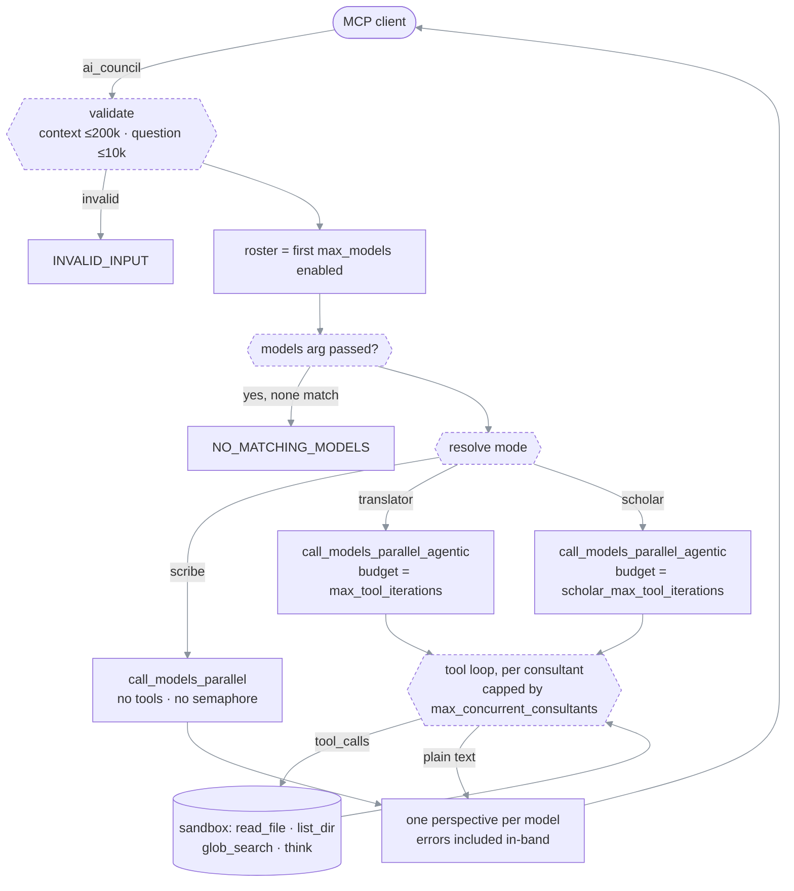

# House of Wisdom MCP

> **What this is** — an MCP (Model Context Protocol) server that asks the same question to several
> different AI model families at once and hands you back every answer, unmerged.
>
> **How to read it** — [What it is](#what-it-is-and-what-it-is-not) → [Quick start](#quick-start) →
> [The three modes](#the-three-modes) → [The two tools](#the-two-tools) →
> [How a call flows](#how-a-call-flows) → [Installation](#installation) →
> [Configuration](#configuration-reference). Go to [Sharp edges](#sharp-edges) when something
> surprises you.
>
> **Requires** — Python 3.10+, `uv`/`uvx`, and at least **two** enabled models.
>
> **Reflects code as of** — 2026-07-19, commit `f729be5`, package version `0.4.3`.

The medieval [Bayt al-Hikma](https://en.wikipedia.org/wiki/House_of_Wisdom) worked because it was
diverse: scholars, translators, and copyists from many traditions read the same questions through
different lenses, and the reader weighed the results. This server does the same with models —
OpenAI, Anthropic and Google via OpenRouter, DeepSeek, local Ollama, or any OpenAI-compatible
endpoint.

---

## What it is, and what it is not

| It does | It does not |
| --- | --- |
| Fire N models in parallel on one question | Merge, rank, vote, or summarize their answers |
| Return one complete, self-contained analysis per model | Return a single "council answer" |
| Optionally let each model read your codebase first (read-only) | Ever write, execute, or network beyond each model's own endpoint |
| Tag each answer with the mode it was asked to run in | Tell you which answer is correct |

**There is no synthesizer.** The caller — your IDE agent — reads every perspective and decides.
Treating any single perspective as ground truth defeats the design.

**Do not fire the council on every prompt.** It costs several model calls and tens of seconds.
Use it only when a *different model family* seeing the problem would plausibly change the outcome.
For work that just needs your own focused reasoning, use a single-mind thinking tool instead.

---

## Quick start

```bash
# 1. Get a config file
curl -O https://raw.githubusercontent.com/EzzoHamdan/house-of-wisdom-mcp/master/config.example.yaml

# 2. Edit it — the only field you MUST set is `models`, and at least 2 must be enabled.

# 3. Register the server with your MCP client (see Installation for per-client syntax):
#    command: uvx
#    args:    --from git+https://github.com/EzzoHamdan/house-of-wisdom-mcp@master
#             ai-council --config /absolute/path/to/config.yaml

# 4. Restart the client, then ask your agent to call `ai_council_list_models`.
```

If `ai_council_list_models` returns your roster, the server is loaded. Then try one `ai_council`
call in `scribe` mode — it is the fast path and needs no filesystem access.

---

## The three modes

One argument, `mode`, decides how much freedom each consultant gets. It is the only knob that
changes behavior at call time.

| Mode | Tools | Tool budget | Scope discipline | Use when |
| --- | --- | --- | --- | --- |
| `scribe` | none | — | — | You already pasted the relevant code into `context`, or the question is a judgment call needing no lookup |
| `translator` | read-only | `max_tool_iterations` (built-in **8**) | `scope_hint` is a **cage** — the prompt forbids wandering | You know which files matter and want each model to verify against them |
| `scholar` | read-only | `scholar_max_tool_iterations` (built-in **64**) | `scope_hint` is a **starting point** — the prompt permits following leads | You do *not* know which files matter |

With default budgets, wall-clock ordering runs `scribe` < `translator` < `scholar`; absolute
numbers depend entirely on which models you configured and whether they are local or remote.
Nothing enforces that ordering, though — raising `max_tool_iterations` above
`scholar_max_tool_iterations` inverts it.

### How the effective mode is resolved

Precedence, highest first (`synthesis.py::collect_perspectives`):

| # | Source | Result |
| --- | --- | --- |
| 1 | `mode` argument, if it is one of `scribe` / `translator` / `scholar` (case-insensitive) | that mode |
| 2 | `mode` argument set to anything else | logs a warning, falls through to 3 |
| 3 | legacy `agentic` argument | `false` → `scribe`, `true` → `translator` |
| 4 | `synthesizer_tools.enabled` in config | `true` → `translator`, `false` → `scribe` |

`agentic` is a deprecated boolean kept so older callers keep working; `mode` wins whenever both
are passed. `scholar` can only be reached by asking for it explicitly.

⚠ `synthesizer_tools.enabled` **only picks the default in row 4.** It is not a gate: an explicit
`mode: "translator"` or `mode: "scholar"` runs the tool loop even when `enabled: false`.

---

## The two tools

### `ai_council_list_models`

Takes no arguments. Returns the configured roster straight from loaded config.

```json
{
  "status": "success",
  "data": {
    "models": [
      {"name": "GLM", "model_id": "glm-5.2:cloud", "provider": "custom", "enabled": true},
      {"name": "Kimi", "model_id": "kimi-k2.7-code:cloud", "provider": "custom", "enabled": true}
    ],
    "max_models": 3,
    "enabled_count": 2
  }
}
```

It does **not** contact any endpoint and does **not** validate API keys. `enabled: true` means
"present in config and not switched off", nothing more. Note that `models` lists every configured
entry, while only the first `max_models` enabled ones can actually fire — see
[Who actually fires](#who-actually-fires).

### `ai_council`

| Argument | Type | Required | Meaning |
| --- | --- | --- | --- |
| `context` | string | **yes** | Background. Must be non-empty, max **200,000** characters. In `scribe` mode this is the only material the models see, so paste file contents here. |
| `question` | string | **yes** | Must be non-empty, max **10,000** characters. |
| `mode` | string | no | `scribe` \| `translator` \| `scholar`. See [resolution order](#how-the-effective-mode-is-resolved). |
| `workspace_root` | string | no | Absolute path used as the read-only sandbox root. Ignored in `scribe`. Falls back to `synthesizer_tools.workspace_root`, then to the **server process's current working directory** — which is set by your MCP client, not by you. Pass it explicitly. |
| `scope_hint` | string | no | Free text injected into each consultant's system prompt, e.g. `"Start with main.py and config.py"`. Ignored in `scribe`. |
| `models` | array of strings | no | Subset of consultant `name` values to fire. Unknown names are dropped silently; if none survive, the call fails with `NO_MATCHING_MODELS`. ⚠ Selects only within the first `max_models` enabled entries. |
| `agentic` | boolean | no | Deprecated alias: `false` → `scribe`, `true` → `translator`. Overridden by `mode`. |

**Success shape.** One entry per model that was dispatched, in roster order:

```json
{
  "status": "success",
  "data": {
    "perspectives": [
      {"label": "GLM",  "model_name": "GLM",  "code_name": "Alpha", "analysis": "...", "status": "ok",    "mode": "translator"},
      {"label": "Kimi", "model_name": "Kimi", "code_name": "Beta",  "analysis": "...", "status": "error", "mode": "translator"}
    ],
    "consensus": {"models_queried": 2, "models_succeeded": 1, "models_failed": 1}
  }
}
```

- Failed consultants are returned **in-band** with `status: "error"` and the error text sitting in
  `analysis`. The call as a whole still reports `"status": "success"` as long as at least one
  consultant succeeded.
- `label` is `model_name` normally, or `code_name` when `anonymous_perspectives: true`.
- `consensus` counts nothing about agreement — despite the name, it is a dispatch tally, and
  `models_failed` is simply the number of `status: "error"` entries.

**Error shape.**

```json
{"status": "error", "error": {"code": "...", "message": "...", "type": "...", "details": "..."}, "data": null}
```

| `code` | Fires when |
| --- | --- |
| `INVALID_INPUT` | `context` or `question` is empty or over its character cap |
| `NO_MATCHING_MODELS` | A `models` array was passed and matched nothing in the fireable window |
| `NOT_ENOUGH_MODELS_ENABLED` | The fireable roster is empty (startup validation normally prevents this) |
| `ALL_MODELS_FAILED` | Every consultant errored or the whole batch timed out |
| `UNKNOWN_TOOL` | Tool name is neither `ai_council` nor `ai_council_list_models` |
| `INTERNAL_ERROR` | Unhandled exception; `details` carries the Python error string |

`data` is `null` on every error except `ALL_MODELS_FAILED`, which carries
`{"attempted_models": N, "failed_responses": N}`. Note that no individual analyses survive that
path — if you need partial results from a slow batch, raise `parallel_timeout` rather than
retrying.

---

## How a call flows

```text
MCP client (the orchestrator)
  │ ai_council(context, question, mode?, workspace_root?, scope_hint?, models?)
  ▼
main.py::_process_ai_council
  ├─ validate      context 1..200,000 chars · question 1..10,000 chars   → INVALID_INPUT
  ├─ roster        config.get_enabled_models()  ==  enabled[:max_models]  ⚠ truncates FIRST
  └─ subset        if `models` passed: keep roster entries whose name matches
                   nothing left?  → NO_MATCHING_MODELS
  ▼
synthesis.py::collect_perspectives
  ├─ mode          mode arg > agentic bool > synthesizer_tools.enabled
  ├─ sandbox       workspace_root arg > config workspace_root > process cwd
  └─ budget        scholar → scholar_max_tool_iterations · else max_tool_iterations
  │
  ├── scribe ───────────► models.py::call_models_parallel
  │                        one chat call per model · temp 0.7 · max_tokens 8000
  │                        ⚠ NO concurrency cap — every model fires at once
  │
  └── translator ───────► models.py::call_models_parallel_agentic
      scholar              semaphore = max_concurrent_consultants
                           per consultant, repeat until it answers or budget runs out:
                             chat(tools=[read_file,list_dir,glob_search,think])
                               ├─ tool_calls? → dispatch in sandbox → append results → loop
                               └─ plain text? → that is the analysis
                           budget exhausted → one forced "answer from what you have" turn
                           temp 0.4 · max_tokens 16000
  ▼
perspectives[]   one per dispatched model, roster order, failures included
  ▼
MCP client weighs them.  No synthesizer runs, in any mode.
```

#### How a call flows (rendered)



---

## Installation

### Prerequisites

| Need | Why |
| --- | --- |
| Python 3.10+ | `requires-python = ">=3.10"` |
| [`uv` / `uvx`](https://docs.astral.sh/uv/getting-started/installation) | How the server is launched. Verify with `uvx --version`. |
| [Ollama](https://ollama.com) on `localhost:11434` | Only for local models. Pull tags first (`ollama pull glm-5.2:cloud`), confirm with `ollama list`. |
| Provider API keys | Only for paid models (OpenAI, OpenRouter, DeepSeek, …). |

### Step 1 — write a config file

Start from [`config.example.yaml`](config.example.yaml), which is fully commented:

```bash
curl -O https://raw.githubusercontent.com/EzzoHamdan/house-of-wisdom-mcp/master/config.example.yaml
mkdir -p ~/.config/ai-council && mv config.example.yaml ~/.config/ai-council/config.yaml
```

`~/.config/ai-council/config.yaml` is the path the server checks when `--config` is omitted. Any
other location works if you pass `--config /absolute/path.yaml`.

⚠ If the path you pass to `--config` does not exist, it is **ignored without an error**. The
server then boots on built-in defaults, whose roster is three OpenRouter models — so the symptom
of a typo'd path is usually `OpenRouter API key is required`, not "file not found".

### Step 2 — register the server with your MCP client

The launch command is identical everywhere; only the surrounding JSON/TOML differs.

```
command:  uvx
args:     --from  git+https://github.com/EzzoHamdan/house-of-wisdom-mcp@master
          ai-council
          --config  /absolute/path/to/config.yaml
```

**Claude Desktop** — Settings → Developer → Edit Config, which opens
`~/Library/Application Support/Claude/claude_desktop_config.json` (macOS) or
`%APPDATA%\Claude\claude_desktop_config.json` (Windows):

```json
{
  "mcpServers": {
    "ai-council": {
      "command": "uvx",
      "args": ["--from", "git+https://github.com/EzzoHamdan/house-of-wisdom-mcp@master",
               "ai-council", "--config", "/absolute/path/to/config.yaml"]
    }
  }
}
```

**Cursor** — same JSON, in `.cursor/mcp.json` (project) or via Settings → MCP (global).

**Kilo Code** — same JSON, in the file opened by the MCP Servers panel
(*Edit Global MCP* → `mcp_settings.json`, or *Edit Project MCP* → `.kilocode/mcp.json`). Kilo
kills a server that is slow to answer, so raise its per-server `timeout` if you use `scholar`
mode:

```json
{
  "mcpServers": {
    "ai-council": {
      "command": "uvx",
      "args": ["--from", "git+https://github.com/EzzoHamdan/house-of-wisdom-mcp@master",
               "ai-council", "--config", "/absolute/path/to/config.yaml"],
      "timeout": 240
    }
  }
}
```

**Claude Code (CLI)** — the `--` separator matters, otherwise `claude` parses `--from` as its own
flag:

```bash
claude mcp add ai-council -- uvx --from git+https://github.com/EzzoHamdan/house-of-wisdom-mcp@master \
  ai-council --config /absolute/path/to/config.yaml
```

**Codex CLI** — `~/.codex/config.toml`:

```toml
[mcp_servers.ai-council]
command = "uvx"
args = ["--from", "git+https://github.com/EzzoHamdan/house-of-wisdom-mcp@master",
        "ai-council", "--config", "/absolute/path/to/config.yaml"]
```

**Anything else** — any client that speaks stdio MCP can run this server. Only the registration
syntax changes.

### Step 3 — restart the client

Config is read once at process start. Every config edit or server upgrade needs a client restart.

### Step 4 — verify

1. Call `ai_council_list_models` → your roster comes back.
2. Call `ai_council` with `mode: "scribe"`, a short `context`, and a short `question` → each model
   answers. This isolates model connectivity from filesystem/sandbox concerns.
3. Only then try `translator` with an explicit `workspace_root`.

---

## Configuration reference

### Every key, with both defaults

"Built-in" is what you get when the key is absent from your YAML. "Example file" is what
[`config.example.yaml`](config.example.yaml) ships with — these differ, so do not read the example
file as documentation of defaults.

| Key | Built-in | Example file | Valid range |
| --- | --- | --- | --- |
| `max_models` | `3` | `3` | 1–10 |
| `parallel_timeout` | `60` | `240` | 5–600 (seconds) |
| `log_level` | `INFO` | `INFO` | `DEBUG` `INFO` `WARNING` `ERROR` `CRITICAL` |
| `anonymous_perspectives` | `false` | `false` | boolean |
| `max_concurrent_consultants` | `3` | `3` | 1–32 |
| `openai_api_key` | unset | commented out | string |
| `openrouter_api_key` | unset | commented out | string |
| `synthesizer_tools.enabled` | `false` | `true` | boolean |
| `synthesizer_tools.workspace_root` | `null` → process cwd | `null` | absolute path |
| `synthesizer_tools.max_tool_iterations` | `8` | `12` | 1–128 |
| `synthesizer_tools.scholar_max_tool_iterations` | `64` | `64` | 1–256 |
| `synthesizer_tools.allowed_tools` | all four | all four | subset of the four tool names — ⚠ `[]` means **all four**, not none |
| `models` | 3 OpenRouter models | 6 enabled Ollama + 4 disabled paid | 2–10 entries (10 configured max, 2 enabled min) |

A minimal working config is just:

```yaml
models:
  - name: "GLM"
    provider: "custom"
    model_id: "glm-5.2:cloud"
    base_url: "http://localhost:11434/v1"
    api_key: "ollama"
    enabled: true
  - name: "Kimi"
    provider: "custom"
    model_id: "kimi-k2.7-code:cloud"
    base_url: "http://localhost:11434/v1"
    api_key: "ollama"
    enabled: true
```

### Startup validation — what stops the server from booting

These are checked at load time. Each exits with `Configuration error: …` on stderr — which your
MCP client usually surfaces as "server failed to start" — wrapped in a Pydantic `ValidationError`,
so the strings below appear as a fragment of a longer message rather than on their own.

| Rule | Message contains |
| --- | --- |
| At least **2** models must have `enabled: true` | `At least two models must be enabled` |
| At most **10** models configured in total | `Cannot configure more than 10 models (found N)` |
| `code_name` values must be unique | `Duplicate code names found in model configuration` |
| `provider: custom` with **no** `api_key` needs a `base_url` | `Custom endpoints require a base_url` / `Custom endpoints require an api_key` |
| `provider: openai` needs a key from somewhere | `OpenAI API key is required if using OpenAI models` |
| `provider: openrouter` needs a key from somewhere | `OpenRouter API key is required if using OpenRouter models` |

⚠ The `custom` rule is weaker than it looks. Validation short-circuits on the presence of
`api_key`, so a `custom` entry **that has an `api_key` is never checked for `base_url`**. With no
`base_url`, the client is built against OpenAI's default endpoint — so a local-Ollama entry
missing its `base_url` boots cleanly and then sends your prompts to `api.openai.com`. Always set
`base_url` on `custom` entries.

### Model entry fields

| Field | Required | Notes |
| --- | --- | --- |
| `name` | yes | Human label. This is the string the `models` call argument matches against. |
| `model_id` | yes | Provider's identifier: an Ollama tag, an OpenRouter slug, an OpenAI model name. |
| `provider` | no (default `openrouter`) | `openai` \| `openrouter` \| `custom` |
| `base_url` | for `custom` | OpenAI-compatible `/v1` endpoint. Not enforced when `api_key` is set — see the warning above. |
| `api_key` | for `custom`, else optional | Overrides the provider-level key for this entry. |
| `enabled` | no (default `true`) | `false` keeps the entry configured but dormant. |
| `code_name` | no | Auto-assigned from `Alpha, Beta, Gamma, …` if omitted. Only surfaces when `anonymous_perspectives: true`. ⚠ Setting it by hand on some entries while running close to the 10-model cap can crash startup — see [Sharp edges](#sharp-edges). |

### Consultant recipes

**Local Ollama** — free, `api_key` can be any non-empty string:

```yaml
models:
  - name: "GLM"
    provider: "custom"
    model_id: "glm-5.2:cloud"          # a tag from `ollama list`
    base_url: "http://localhost:11434/v1"
    api_key: "ollama"
    enabled: true
```

**OpenAI** — one shared key at the top of the file:

```yaml
openai_api_key: "sk-..."
models:
  - name: "GPT-5.6-Terra"
    provider: "openai"
    model_id: "gpt-5.6-terra"
    enabled: true
```

**Claude / Gemini / most others via OpenRouter** — one key, many families. `model_id` is the slug
from [openrouter.ai/models](https://openrouter.ai/models):

```yaml
openrouter_api_key: "sk-or-..."
models:
  - name: "Claude Opus"
    provider: "openrouter"
    model_id: "anthropic/claude-opus-4"
    enabled: true
  - name: "Gemini Pro"
    provider: "openrouter"
    model_id: "google/gemini-2.5-pro"
    enabled: true
```

**DeepSeek direct, Perplexity, Groq, Together, vLLM, LM Studio** — anything OpenAI-compatible uses
`provider: custom` with its own `base_url` and `api_key`:

```yaml
models:
  - name: "DeepSeek-Pro"
    provider: "custom"
    model_id: "deepseek-chat"
    base_url: "https://api.deepseek.com/v1"
    api_key: "sk-your-deepseek-key"
    enabled: true
```

### API keys — where they are read from

Per model, first match wins:

1. `api_key` on the model entry — always wins for that entry, whatever the provider.
2. The provider-level key (`openai_api_key` for `provider: openai`, `openrouter_api_key` for
   `provider: openrouter`), which is itself resolved as **CLI flag → YAML top-level field →
   environment variable**.

`provider: custom` entries never fall back to a provider-level key; they require their own
`api_key`.

⚠ **The environment variable names are `OPENAI_API_KEY` and `OPENROUTER_API_KEY` — with no
prefix.** The `AI_COUNCIL_` prefix that applies to other settings does **not** apply to these two
fields, because they declare a Pydantic alias and an alias suppresses the prefix. Two consequences:

- `AI_COUNCIL_OPENAI_API_KEY` is silently ignored. ⚠ So are the comments in
  [`config.example.yaml`](config.example.yaml) that recommend it.
- Whatever `OPENAI_API_KEY` / `OPENROUTER_API_KEY` already exists in the environment your MCP
  client launches will be picked up, whether or not you intended it.

Every *other* setting does use the prefix, and matches case-insensitively:
`AI_COUNCIL_MAX_MODELS`, `AI_COUNCIL_PARALLEL_TIMEOUT`, `AI_COUNCIL_LOG_LEVEL`,
`AI_COUNCIL_MAX_CONCURRENT_CONSULTANTS`, `AI_COUNCIL_ANONYMOUS_PERSPECTIVES`.

### Who actually fires

Three separate limits, applied in this order:

```text
configured models        ── enabled: true ──►  enabled models
enabled models           ── [:max_models] ──►  the fireable window     ⚠ order matters
the fireable window      ── `models` arg  ──►  this call's roster
this call's roster       ── semaphore     ──►  N running at once (translator/scholar only)
```

- `max_models` (1–10) truncates by **position in the YAML list**, not by preference. The first
  three enabled entries are the fireable window.
- ⚠ The per-call `models` argument filters *the window*, not the full roster. With eight enabled
  models and `max_models: 3`, asking for the seventh by name returns `NO_MATCHING_MODELS`. To make
  a model reachable per-call, either raise `max_models` or move its entry up the list.
- `max_concurrent_consultants` (1–32) caps how many tool loops run simultaneously; the rest queue.
  Match it to your provider's concurrency allowance (Ollama Cloud Pro = 3, Max = 10).
  ⚠ It is **not** applied in `scribe` mode — there, every model in the roster fires at once.

---

## The consultant sandbox

In `translator` and `scholar` modes each consultant gets its own read-only tool loop, rooted at
`workspace_root`. These tools are internal to the consultant; they are never exposed to your MCP
client.

| Tool | Signature | Behavior |
| --- | --- | --- |
| `read_file` | `path` | UTF-8 read, truncated at 200,000 bytes with a `...[truncated]` marker. Undecodable bytes are replaced, not fatal. |
| `list_dir` | `path` (default root) | One entry per line, relative to root, `/` suffix on directories. |
| `glob_search` | `pattern` | Glob relative to root, e.g. `**/*.py`. Capped at 100 results. |
| `think` | `thought` | Echoes the thought back. No I/O. Costs budget on the same terms as the others. |

Restrict the set with `synthesizer_tools.allowed_tools`; a call to a tool outside the list returns
an error string to the model rather than executing. ⚠ An **empty** list is treated as permissive,
not restrictive — `allowed_tools: []` advertises and permits all four. To actually narrow the
surface, name the tools you want, e.g. `["read_file", "think"]`.

### What never happens

- No writes, no shell, no network from the tools. The four above are the entire surface
  (`tools.py::ToolRegistry.call`).
- No read outside `workspace_root`. Paths are resolved with `Path.resolve()` and checked with
  `relative_to()`, so symlinks pointing out of the root are rejected as `SandboxViolation`
  (`tools.py::ToolRegistry._resolve`).
- No tool call at all in `scribe` mode.
- No endpoint contact from `ai_council_list_models`.
- No merging of perspectives, in any mode.

### Budget accounting

The loop stops when the model replies with plain text instead of tool calls, or when the budget is
spent — after which it gets one forced turn to answer from what it gathered, and a second nudge if
that comes back empty.

⚠ The budget counts **rounds**, not individual tool calls: one unit per assistant turn that
contains tool calls, however many it contains. A model that requests four files in a single turn
spends one unit, not four — and a `think` batched alongside them is free. The system prompt tells
the model that each call costs one unit, so most models behave as if the stricter accounting were
real, but a batching model can legitimately read far more of your workspace than the budget number
suggests.

---

## Operational envelope

Values are hardcoded in `models.py`; listed here because they are not otherwise visible from the
outside.

| Path | Temperature | `max_tokens` | Timeout |
| --- | --- | --- | --- |
| `scribe` (`call_model`) | 0.7 | 8,000 | `parallel_timeout`, applied to the whole batch |
| `translator` / `scholar` (`call_model_with_tools`) | 0.4 | 16,000 | `parallel_timeout`, applied **both** per consultant and to the whole batch |

Empty responses get one automatic retry. Models that return their answer in a `reasoning`,
`thinking`, or `reasoning_content` field instead of `content` — common with Ollama's cloud
thinking models — are handled by `models.py::_extract_text`.

⚠ Because `parallel_timeout` also bounds the whole batch, and because queued consultants spend
their wait inside that window, a `scholar` run with more models than
`max_concurrent_consultants` needs a generous value. When the batch timeout fires, **every**
perspective is replaced with a timeout string, including consultants that had already finished,
and the call returns `ALL_MODELS_FAILED`.

---

## Sharp edges

Known divergences between what the system looks like it does and what it does. Each is verified
in code.

| ⚠ | Detail |
| --- | --- |
| Env prefix | `AI_COUNCIL_OPENAI_API_KEY` / `AI_COUNCIL_OPENROUTER_API_KEY` do nothing. Use the unprefixed names. `config.py:105-106` |
| `models` argument | Filters the post-`max_models` window, so high-index models are unreachable per-call. `main.py:333-336` |
| `synthesizer_tools.enabled` | A default-mode switch, not a capability gate — explicit `mode` bypasses it. `synthesis.py:126-135` |
| Concurrency cap | `max_concurrent_consultants` is only honored in `translator`/`scholar`. `models.py::call_models_parallel` has no semaphore. |
| Batch timeout | Discards the work of consultants that already succeeded. `models.py:494-507` |
| Reported `mode` | Is the mode you *asked for*. If agentic setup raises, the run silently degrades to plain no-tool calls but the perspectives are still tagged `translator`/`scholar`. `synthesis.py:169-180`, stamped at `synthesis.py:197` |
| `status` detection | Decided by prefix-matching the analysis text against strings like `"Error from"` and `"Timeout error"`. Cuts both ways: an answer legitimately opening with one of those words is marked `error`, and the empty-response fallbacks (`"Consultant returned empty content after retry."`) match no prefix, so a consultant that produced nothing is marked `ok`. `synthesis.py:184-190`, `models.py:278,316` |
| `custom` without `base_url` | Not caught when `api_key` is set; the entry silently talks to `api.openai.com`. `config.py:234-241`, `models.py:92-101` |
| `allowed_tools: []` | Permits all four tools rather than none. `tools.py:121,237-238` |
| `anonymous_perspectives` | Changes `label` only. `model_name` and `code_name` are always both present in the payload, so this hides nothing from the orchestrator. |
| `code_name` auto-assign | Names are drawn from a list that shrinks when you set some by hand, but indexed by absolute position — so 10 configured models with at least one hand-set `code_name` raises `IndexError` at startup and reports as `Failed to start AI Council server`, not `Configuration error`. The example config ships exactly 10 entries. `config.py:185-197` |
| Missing config path | `--config /typo.yaml` is ignored silently and built-in defaults take over — including their OpenRouter roster. There is no fallback to `~/.config/ai-council/config.yaml`; that path is only probed when `--config` is omitted entirely. `config.py:262-269` |
| Advertised version | The server announces itself to MCP clients as version `0.2.3` while the package is `0.4.3`. `main.py:438` |
| `synthesis_model_selection` | Accepted in YAML, never read. No synthesizer exists to select. |
| Tool budget | Counts assistant turns containing tool calls, not individual calls. |
| In-client tool description | The `ai_council` description your agent reads calls `translator` the default and quotes a ~12-call budget. Both describe the example config, not the built-in defaults (`scribe`, 8). This table and the [defaults table](#every-key-with-both-defaults) are authoritative. `main.py:148-151` |

---

## CLI arguments

| Flag | Effect |
| --- | --- |
| `--config PATH` | Config file. Without it, `~/.config/ai-council/config.yaml` is tried. |
| `--max-models N` | Overrides `max_models`. |
| `--parallel-timeout N` | Overrides `parallel_timeout`, in seconds. |
| `--log-level LEVEL` | `DEBUG` \| `INFO` \| `WARNING` \| `ERROR`. (`CRITICAL` is valid in YAML but not accepted here.) |
| `--openai-api-key KEY` | Overrides the YAML value. |
| `--openrouter-api-key KEY` | Overrides the YAML value. |

Logs go to stderr, which is where MCP clients collect server output. `--log-level DEBUG` prints
every tool call each consultant makes.

---

## Code map

| Concern | Source |
| --- | --- |
| MCP wiring, tool schemas, request validation, error shapes | [`ai_council/main.py`](ai_council/main.py) |
| Mode enum, mode resolution, per-mode prompt suffixes, perspective assembly | [`ai_council/synthesis.py`](ai_council/synthesis.py) |
| Client construction, parallel dispatch, the tool loop, concurrency semaphore | [`ai_council/models.py`](ai_council/models.py) |
| Config schema, defaults, startup validation, YAML/env loading | [`ai_council/config.py`](ai_council/config.py) |
| Sandbox, the four tools, path resolution, tool schemas | [`ai_council/tools.py`](ai_council/tools.py) |
| Structured stderr logging | [`ai_council/logger.py`](ai_council/logger.py) |

Run the tests with `uv run pytest` (or `pytest -q` inside an activated venv). They cover config
parsing and sandbox path resolution; there is no test that exercises a live model call.

---

## Acknowledgments

Inspired by [Cognition Wheel](https://github.com/Hormold/cognition-wheel), which established the
wisdom-of-crowds approach to multi-model consultation. This project diverges from it in dropping
the synthesis step entirely, adding the three named modes, giving every consultant its own
read-only investigation loop, and pushing the weighing of perspectives back onto the caller. The
medieval House of Wisdom supplied the name and the principle: many lenses, weighed by the reader,
not merged by an authority.

## License

MIT — see [LICENSE](LICENSE).
