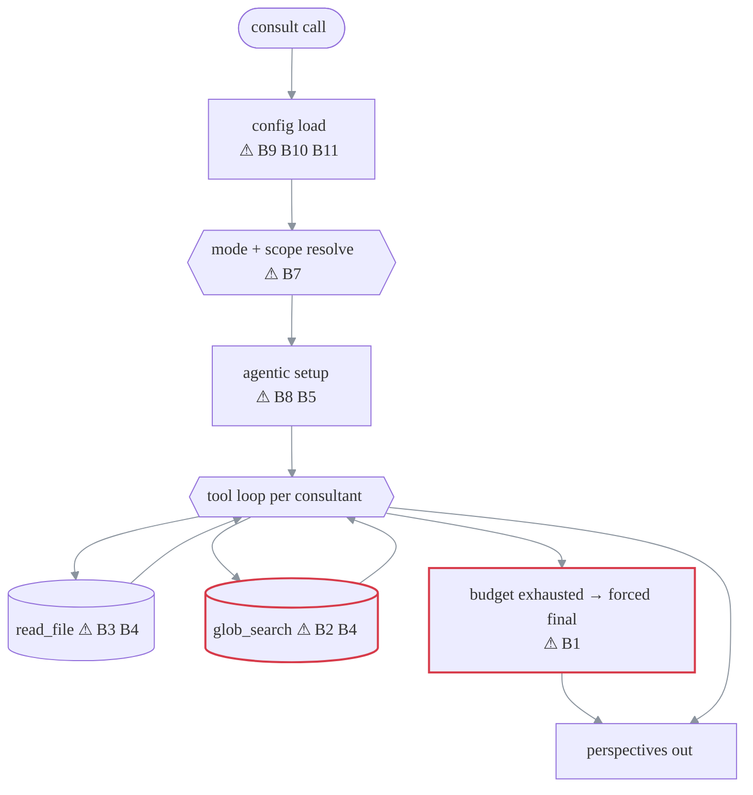

# PLAN — Bug audit findings (v0.6.1)

> Status: active
> Created: 2026-07-21 · Last updated: 2026-07-21
> Owns: defects found in a full-source audit that need fixing · Does not own: improvements that change design or add capability — those live in [enhancement-candidates.md](enhancement-candidates.md)
> Done when: every High/Medium item below is fixed with a regression test, and the README sharp-edges section matches the code again
> Reflects code as of: 2026-07-21, commit `c9be2e0`, package version `0.6.1`
> Verify with: `uv run pytest -q` (baseline: 62 passed) · repro snippets inline per finding

Findings are ordered by severity. B1–B5 were verified by running the code (Python 3.13.13);
B6–B12 are verified by direct source reading. Each fix should land with a test — none of these
paths are covered today.

## Summary table

| ID | Severity | Where | One-line defect |
| --- | --- | --- | --- |
| B1 | High | [models.py:366](../../ai_council/models.py#L366) | Budget-exhaustion "forced final" violates the OpenAI tool-calling message contract → 400 error instead of an answer |
| B2 | High | [tools.py:106-108](../../ai_council/tools.py#L106-L108) | `glob_search` escapes the sandbox via `..` patterns (verified on Python 3.13) |
| B3 | Medium | [tools.py:74](../../ai_council/tools.py#L74) | `read_file` truncation marker compares chars to bytes — silent truncation on multibyte files, spurious marker at exactly 200k |
| B4 | Medium | [tools.py:136](../../ai_council/tools.py#L136) | Consultants can override tool caps (`max_bytes`, `max_results`) via tool-call arguments |
| B5 | Medium | [synthesis.py:153](../../ai_council/synthesis.py#L153) → [models.py:317](../../ai_council/models.py#L317) | `allowed_tools: []` sends `tools: []` to the API — strict endpoints reject it, killing every translator/scholar call |
| B6 | Medium | README:384, README:603 | README contradicts the code (and itself) on `allowed_tools: []` semantics |
| B7 | Medium | [synthesis.py:150-151](../../ai_council/synthesis.py#L150-L151) + [models.py:532-539](../../ai_council/models.py#L532-L539) | Scholar mode gets a self-contradictory prompt: "SCOPE (strict) … Do NOT read outside it" wrapping "scope is a STARTING POINT, not a cage" |
| B8 | Medium | [synthesis.py:169-176](../../ai_council/synthesis.py#L169-L176) | Bad `workspace_root` silently degrades to no-tool answers still tagged `translator`/`scholar` |
| B9 | Low | [config.py:350-362](../../ai_council/config.py#L350-L362) | `.env` parser keeps inline comments — `KEY=sk-abc # prod` yields the literal value `sk-abc # prod` |
| B10 | Low | [config.py:389-391](../../ai_council/config.py#L389-L391) | Nonexistent `--config` path silently ignored; server boots on built-in OpenRouter defaults |
| B11 | Low | [config.py:221-224](../../ai_council/config.py#L221-L224) | Duplicate model `name` values pass validation — ambiguous `models` arg matching and labels |
| B12 | Low | [\_\_init\_\_.py:4-5](../../ai_council/__init__.py#L4-L5) et al. | Stale "synthesizes their responses" wording in docstring and user-visible error strings |

## Where each bug sits in the call flow

```text
consult(context, question, mode, workspace_root, models)
  │
  ├─ config load ──────────── B9 (.env inline comments) · B10 (missing --config silent)
  │                           B11 (duplicate names unvalidated)
  ├─ mode + scope resolve ─── B7 (contradictory scholar prompt)
  ├─ agentic setup ────────── B8 (ToolRegistry failure → silent scribe run, wrong mode tag)
  │                           B5 (allowed_tools: [] → tools=[] → 400)
  ├─ per-consultant tool loop
  │    ├─ read_file ───────── B3 (truncation marker) · B4 (cap override)
  │    ├─ glob_search ─────── B2 (.. sandbox escape) · B4 (cap override)
  │    └─ budget exhausted ── B1 (forced-final 400)
  └─ docs ─────────────────── B6 (README vs code) · B12 (stale "synthesis" wording)
```

### Where each bug sits (rendered)



## Findings in detail

### B1 — Forced-final turn violates the tool-calling message contract (High)

When a consultant exceeds `max_iterations`, [models.py:366-367](../../ai_council/models.py#L366-L367)
appends the assistant message **still carrying its unanswered `tool_calls`**, then a user message,
and calls the API again. OpenAI (and strict OpenAI-compatible endpoints) reject that history with
`400: An assistant message with 'tool_calls' must be followed by tool messages responding to each
'tool_call_id'`. The strip-and-retry in `_create_completion` only handles
`unsupported_parameter`/`unsupported_value`, so the error propagates and the consultant fails.

Net effect: the entire "budget exhausted → answer from what you have" recovery path — the
mechanism the system prompt promises — is broken on strict endpoints. Exactly the runs that used
their full budget (the expensive ones) return an error instead of an analysis. Lenient endpoints
(Ollama) mask it, which is why it survives.

**Fix:** before the forced-final call, append one `role: "tool"` stub per `tool_call_id`
(e.g. `"[tool budget exhausted — call not executed]"`), or strip `tool_calls` from the dumped
assistant message. Test with a fake client that enforces the OpenAI message-ordering rule.

### B2 — `glob_search` escapes the sandbox via `..` (High)

[tools.py:106-108](../../ai_council/tools.py#L106-L108) checks each glob match with
`p.relative_to(self.workspace_root)` on the **unresolved** path. `relative_to` is lexical:
`root/../sibling` "starts with" `root`, so the check passes. On Python 3.13 (the project's pinned
version), `Path.glob` accepts `..` segments, so patterns walk out of the sandbox.

Verified repro:

```python
reg = ToolRegistry(workspace_root="/some/dir")
reg.call("glob_search", {"pattern": "../*"})        # lists the PARENT directory
reg.call("glob_search", {"pattern": "../**/*.txt"}