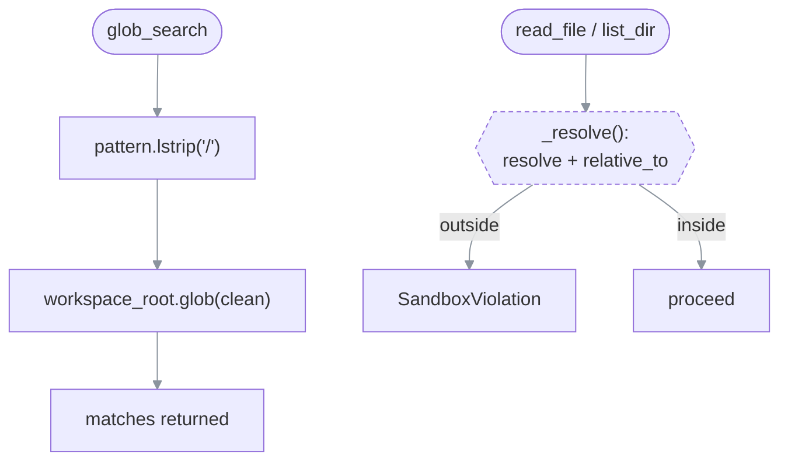

# PLAN — Bugs & issues to resolve

> Status: resolved (all fixed 2026-07-21)
> Created: 2026-07-21 · Last updated: 2026-07-21
> Owns: correctness/security defects found in a full read of `ai_council/` at commit `c9be2e0` (v0.6.1) · Does not own: feature ideas and non-defect polish → [enhancements.md](enhancements.md)
> Done when: B1–B5 are fixed with regression tests; B6–B7 fixed or consciously waived. ✅ all fixed; suite is 72 passing (was 62).

## How to read it

Findings are ordered by severity. Each row of the summary table links to a section with the
falsifiable claim, the exact code anchor, a reproduction, and a fix sketch. Every bug below was
reproduced against the working tree — none are speculative. **All seven are now fixed**, each with
a regression test that would have caught it.

| ID | Severity | Status | One-line | Anchor |
| --- | --- | --- | --- | --- |
| [B1](#b1) | High | ✅ fixed | `glob_search` enumerated paths **outside** the sandbox — now boundary-checked | `tools.py::glob_search` |
| [B2](#b2) | High | ✅ fixed | SCHOLAR mode contradicted itself — mode guidance now sits outside the strict scope cage | `synthesis.py` + `models.py::build_consultant_system_prompt` |
| [B3](#b3) | Medium | ✅ fixed | `read_file` truncation marker mixed bytes vs chars — now decided on byte length | `tools.py::read_file` |
| [B4](#b4) | Medium | ✅ fixed | The 200 KB `read_file` cap was model-overridable — `max_bytes` removed from the signature | `tools.py::read_file` |
| [B5](#b5) | Medium | ✅ fixed | README said `allowed_tools: []` permits all four; corrected to "none; omit for all" | `README.md` |
| [B6](#b6) | Low | ✅ fixed | `.env` inline comments were kept in the value — now stripped (quoted `#` preserved) | `config.py::_load_dotenv_files` |
| [B7](#b7) | Low | ✅ fixed | Dead `custom`-provider branch in client construction — collapsed | `models.py::_get_client_for_model` |

Regression tests: `test_tools.py` (B1/B3/B4), `test_prompt_assembly.py` (B2),
`test_config.py::test_dotenv_strips_inline_comment` + `..._hash_inside_quotes_is_kept` (B6).

---

## B1 — `glob_search` escapes the sandbox for path enumeration {#b1}

**Claim (falsifiable):** With `workspace_root = /w`, calling `glob_search("../*")` returns entries
from `/w`'s parent. `read_file` and `list_dir` reject the same traversal; `glob_search` does not.

**Why.** `read_file`/`list_dir` route through `_resolve` (`tools.py:43-60`), which does
`Path.resolve()` then `resolved.relative_to(self.workspace_root)` and raises `SandboxViolation`
on escape. `glob_search` (`tools.py:96-116`) skips `_resolve` entirely: it only does
`pattern.lstrip("/")` and then `self.workspace_root.glob(clean)`. A `..` segment in the pattern
walks above the root, and none of the returned matches are boundary-checked.

**Reproduction** (verified 2026-07-21):

```text
glob_search("../**/*.txt")  → ../tmpqeqotk5y/big.txt
                              ../tmpqeqotk5y/exact.txt      # sibling dir, OUTSIDE the root
read_file("../../etc/hosts") → Error: Path ... resolves outside workspace_root   # correctly blocked
```

**Impact.** File *contents* outside the root still can't be read (`read_file` blocks), but
directory structure and filenames leak — enough to fingerprint a machine (home-dir layout,
sibling project names, dotfiles). It directly falsifies the README's "No read outside
`workspace_root`" guarantee ([README.md](../../README.md) §"What never happens").

```text
        glob_search(pattern)
              │
   pattern.lstrip("/")           ← only strips a leading slash; ".." survives
              │
   workspace_root.glob(clean)    ← walks above root, NO relative_to() check
              │
        matches returned          ← names outside the sandbox leak
```



**Fix.** Filter glob results through the same boundary check, and reject `..` in the pattern.
Sketch:

```python
for p in self.workspace_root.glob(clean):
    try:
        rel = p.resolve().relative_to(self.workspace_root)
    except ValueError:
        continue  # escaped the root — drop silently
    matches.append(rel.as_posix())
```

Regression test: `glob_search("../*")` must return `"No matches..."`, and a symlink inside the
root pointing out must not appear.

---

## B2 — SCHOLAR mode is instructed to both roam and not roam {#b2}

**Claim (falsifiable):** In `scholar` mode the consultant system prompt contains, adjacent to each
other, "the scope above is a STARTING POINT, not a cage" **and** "SCOPE (strict): … Do NOT read,
list, or glob paths outside it." The two cancel; scholar's defining behavior (follow leads
elsewhere) is undermined on every scholar call, even when the caller passed no `scope_hint`.

**Why.** `synthesis.py:150-151` concatenates the mode suffix onto the scope string:

```python
mode_suffix = MODE_PROMPT_SUFFIX.get(mode, "")          # scholar → "…scope is a STARTING POINT, not a cage…"
effective_scope = (scope_hint or "") + mode_suffix       # non-empty even when scope_hint is None
```

That combined string is passed as `scope_hint=` into `call_models_parallel_agentic`, where
`models.py:532-539` wraps *any* non-empty scope in a strict cage:

```python
if scope_hint and scope_hint.strip():
    scope_block = (
        "\n\nSCOPE (strict):\n"
        f"{scope_hint.strip()}\n"                         # ← the SCHOLAR "not a cage" text lands here
        "Stay within this scope. Do NOT read, list, or glob paths outside it…\n"
    )
```

So the scholar suffix is relabeled "SCOPE (strict)" and immediately followed by "Do NOT read
outside it." Because the suffix is always non-empty, this fires on **every** scholar run,
`scope_hint` or not.

**Impact.** SCHOLAR — the whole reason the third mode exists — is neutered into TRANSLATOR-like
behavior by contradictory instructions. Different models resolve the contradiction differently,
so the mode is also non-deterministic.

**Fix.** Keep mode guidance separate from the strict scope cage. Options:
1. Pass the mode suffix through a distinct argument that is appended *outside* the "SCOPE
   (strict)" block, and only build the strict block from a real caller `scope_hint`.
2. Make the strict wording conditional on mode: TRANSLATOR gets "Do NOT read outside it";
   SCHOLAR gets "prefer this scope, but you may follow relevant leads."

Regression test: assert the assembled scholar system prompt does **not** contain
"Do NOT read, list, or glob paths outside it" when mode is SCHOLAR.

---

## B3 — `read_file` truncation marker mixes bytes and characters {#b3}

**Claim (falsifiable):** `read_file` slices `max_bytes` **bytes** then compares
`len(text) >= max_bytes` on the decoded **string**. For an exactly-200,000-byte ASCII file (not
truncated) it appends a false "truncated" marker; for a 300,000-byte UTF-8 file of 2-byte chars it
truncates to 100,000 chars and appends **no** marker.

**Why.** `tools.py:70-75`:

```python
data = resolved.read_bytes()[:max_bytes]     # byte slice
text = data.decode("utf-8", errors="replace")
if len(text) >= max_bytes:                    # char count vs byte cap
    text += f"\n...[truncated at {max_bytes} bytes]"
```

**Reproduction** (verified 2026-07-21):

```text
200,000-byte ASCII, NOT truncated  → has_marker=True   (false positive)
300,000-byte UTF-8 (é×150k), truncated → has_marker=False (missing warning)
```

**Impact.** A consultant either believes a complete file was cut, or reads a silently-cut file and
reasons over a partial view without knowing it — a correctness risk for grounded analysis, and the
marker can also split a multibyte char at the boundary (mitigated by `errors="replace"`).

**Fix.** Track truncation from the byte length, not the decoded string:

```python
raw = resolved.read_bytes()
truncated = len(raw) > max_bytes
text = raw[:max_bytes].decode("utf-8", errors="replace")
if truncated:
    text += f"\n...[truncated at {max_bytes} bytes]"
```

---

## B4 — the model can raise its own `read_file` byte cap {#b4}

**Claim (falsifiable):** A consultant tool call `read_file(path=…, max_bytes=10_000_000)` returns
up to 10 MB, bypassing the intended 200 KB guard.

**Why.** `max_bytes` is a plain parameter of `read_file` (`tools.py:62`), and the dispatcher
forwards model-supplied arguments verbatim: `fn(**arguments)` (`tools.py:136`). The tool *schema*
(`tools.py:151-172`) doesn't advertise `max_bytes`, so well-behaved models won't send it — but
nothing rejects it.

**Reproduction** (verified 2026-07-21): `call("read_file", {"path": "big.txt",
"max_bytes": 10_000_000})` returned 500,000 chars from a 500 KB file.

**Impact.** A single tool call can pull an arbitrarily large file into the model's context
(cost/latency blow-up, possible provider-side context overflow). Low security impact (still inside
the sandbox once B1 is fixed), medium operational impact.

**Fix.** Make the cap non-overridable: drop `max_bytes` from the public signature and clamp
internally, e.g. `capped = min(caller_hint or MAX, MAX)`, or strip unknown keys before
`fn(**arguments)` against each tool's declared schema.

---

## B5 — README says `allowed_tools: []` permits all four; code permits none {#b5}

**Claim (falsifiable):** The README twice states an empty `allowed_tools` list is permissive
(all four tools). The current code treats `[]` as an empty allowlist that permits **nothing**. One
of the two is a defect; the code is the intended post-fix behavior, so the README is stale.

**Why.** [README.md:384](../../README.md) and [README.md:605](../../README.md) say:

> ⚠ `[]` means **all four**, not none … `allowed_tools: []` advertises and permits all four.

But `tools.py:37-40` distinguishes `None` (no allowlist → all) from `[]` (empty allowlist → none):

```python
self.allowed = None if allowed_tools is None else set(allowed_tools)   # [] → set() → empty
```

and `call` (`tools.py:122-125`) rejects every name when `self.allowed` is a non-None empty set;
`filter_schemas([])` (`tools.py:238-248`) returns no schemas. The in-code comments explicitly
describe this as a fix ("Previously both collapsed to return everything").

**Impact.** A user who follows the README and sets `allowed_tools: []` expecting the full toolset
gets a sandbox with **zero** tools — every consultant loses read access and degrades to answering
blind. A stale imperative is worse than a stale fact because there's no code nearby to contradict
it.

**Fix.** This is a docs fix: update both README locations to state `[]` permits nothing and `null`
(omit the key) permits all four. Then verify no other doc repeats the old claim (`grep -n
'allowed_tools' README.md`). Pair with the code side under `commit-flow` (code first if any code
changes, else docs-only).

---

## B6 — `.env` values keep trailing inline comments {#b6}

**Claim (falsifiable):** A line `AI_COUNCIL_OPENAI_API_KEY=sk-abc # comment` is loaded with the
value `sk-abc # comment`, not `sk-abc`.

**Why.** `_load_dotenv_files` (`config.py:350-362`) only strips whole-line comments
(`line.startswith("#")`) and surrounding quotes; it never splits an inline `#`.

**Reproduction** (verified 2026-07-21): parsed value was `'sk-abc # production key'`.

**Impact.** A key with a trailing comment (a very common `.env` habit) is sent to the provider
malformed → auth failure that's hard to diagnose, since the file "looks right." Low frequency, but
the failure mode is opaque.

**Fix.** Strip an unquoted trailing comment before de-quoting, matching common dotenv parsers
(only when the value is not itself quoted). Add a test line with an inline comment.

---

## B7 — dead `custom`-provider branch in `_get_client_for_model` {#b7}

**Claim (falsifiable):** In `models.py:86-92`, the `elif model_config.provider == Provider.CUSTOM`
branch assigns `api_key = model_config.api_key` — but that line is only reached when the preceding
`if model_config.api_key:` was falsy, so the assignment always sets `api_key` to a falsy value and
the next `if not api_key: raise` always fires.

**Why.** The first `if model_config.api_key:` already captures every truthy custom key, so the
CUSTOM branch's assignment is dead. Startup validation (`config.py:305-316`) already rejects a
keyless custom model, so this path is defensive-only.

**Impact.** None functional — pure dead code / confusion for the next reader. Listed for a cleanup
pass, not a fix priority.

**Fix.** Collapse to a comment or remove the redundant assignment; let the single early
`if model_config.api_key:` plus the CUSTOM `base_url` handling stand.

---

## Verification

```bash
uv run pytest -q          # 62 passing at c9be2e0 — none of the above are covered yet
```

The suite does not exercise the sandbox glob boundary, the truncation marker, mode-prompt
assembly, or `.env` parsing edge cases; each fix above should land with a test that would have
caught it.
